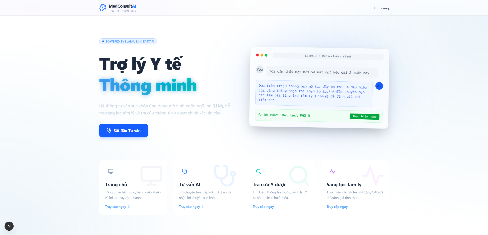
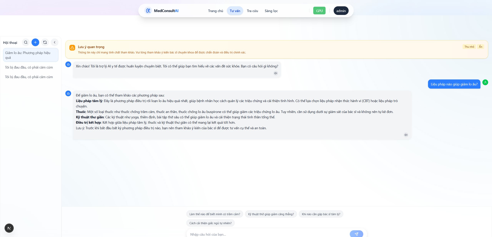
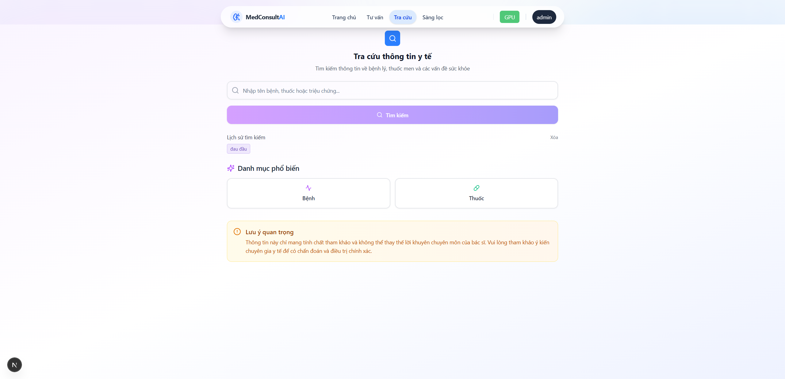
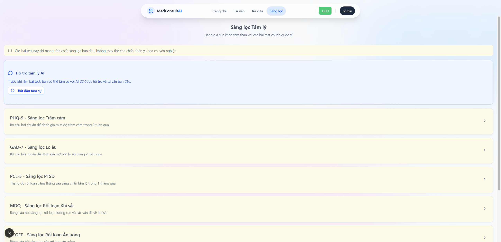
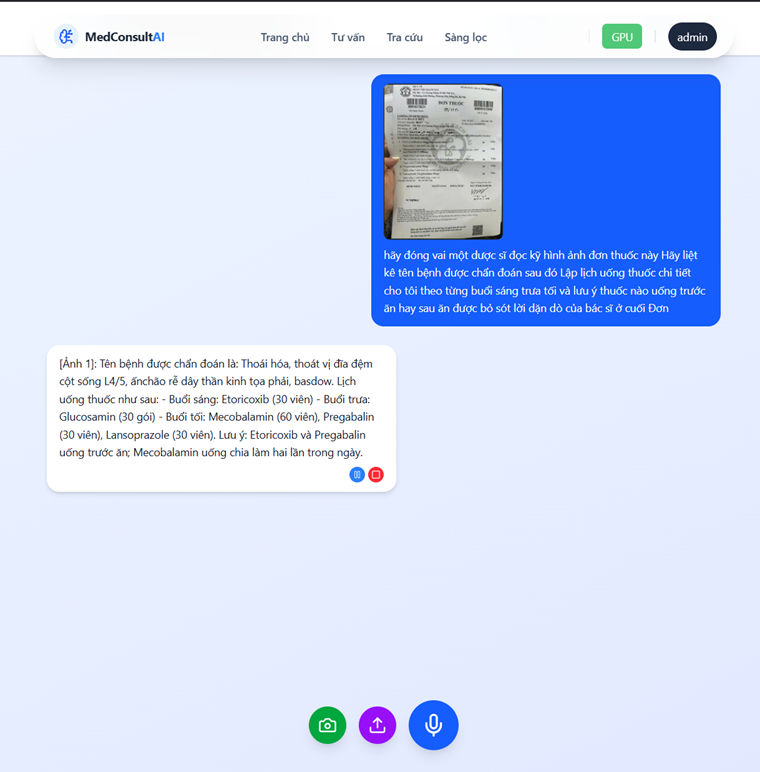
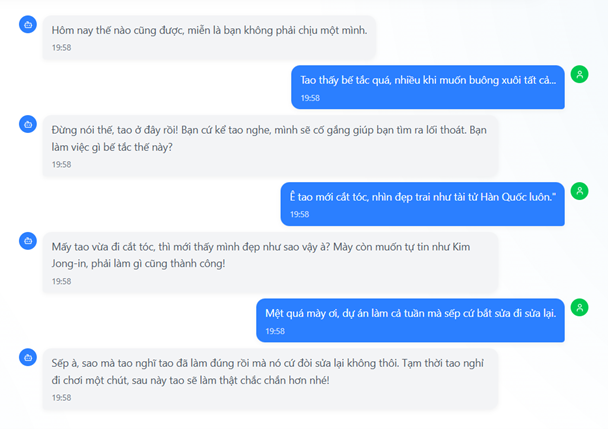
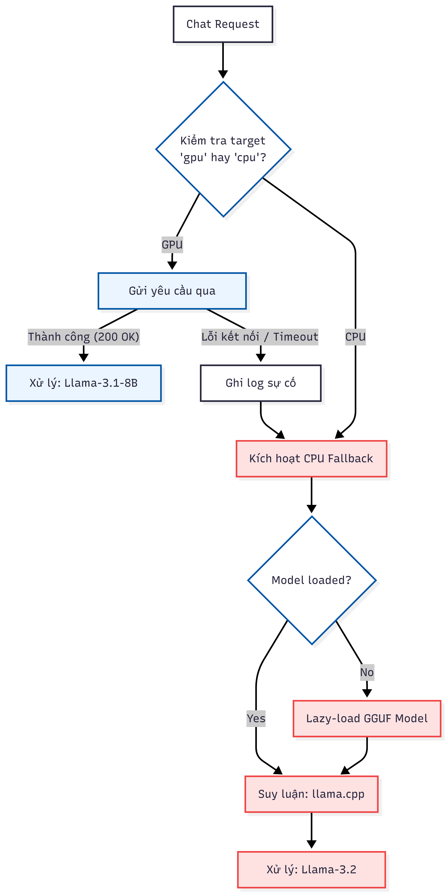

# Hệ thống Tư vấn Y tế AI (Medical Consulting System)

Hệ thống Chatbot Tư vấn Y tế thông minh hỗ trợ người dùng tra cứu thông tin sức khỏe, sàng lọc tâm lý và tư vấn sơ bộ dựa trên kiến trúc Hybrid AI (kết hợp xử lý CPU cục bộ và GPU đám mây).

## 🏆 3 Trụ Cột Cốt Lõi (Project Pillars)

Dự án được xây dựng dựa trên 3 trụ cột công nghệ và sáng tạo, giải quyết các bài toán thực tế:

### 1. Kiến trúc Hybrid (GPU-CPU Fallback)
> **Giải pháp tối ưu cho bối cảnh hạ tầng Việt Nam.**
*   **Đóng góp chính**: Thuật toán **Smart Routing** (Định tuyến thông minh).
*   **Giá trị**: Hệ thống không chỉ chạy AI mà còn có khả năng **tự phục hồi** khi mất kết nối máy chủ Cloud. Cơ chế Fallback đảm bảo tính sẵn sàng cao (**High Availability**) - Chatbot vẫn hoạt động (mode offline) ngay cả khi mất mạng hoặc GPU Server sập.

### 2. Bản địa hóa sâu (Vietnamese Medical Localization)
> **Hiểu người Việt hơn GPT-4.**
*   **Khác biệt**: Hệ thống được tinh chỉnh trên tập dữ liệu y tế tiếng Việt thực tế, không chỉ dịch thuật máy móc.
*   **Năng lực RAG**: Khả năng hiểu các **thuật ngữ dân gian** (như *"trúng gió"*, *"giời leo"*, *"nổi mề đay"*) và nhận diện chính xác **tên thuốc nội địa** đang lưu hành tại Việt Nam thông qua cơ chế RAG (Retrieval-Augmented Generation).

### 3. Tích hợp Sàng lọc tâm lý & Bạn tâm giao
> **Chăm sóc toàn diện: Thể chất & Tinh thần.**
*   **Vấn đề**: Đa số chatbot y tế hiện nay chỉ tập trung tư vấn triệu chứng vật lý.
*   **Giải pháp**: Đề tài nổi bật ở việc kết hợp **Y tế thể chất + Sức khỏe tâm thần**.
*   **Thực tiễn**: Số hóa các thang đo chuẩn y khoa (**PHQ-9**, **GAD-7**) vào hội thoại tự nhiên, giúp phát hiện sớm dấu hiệu trầm cảm/lo âu một cách tinh tế và riêng tư.

## 🚀 Tính Năng Nổi Bật

- **Tư vấn đa phương thức**: Hỗ trợ chat văn bản, giọng nói (Speech-to-Text/Text-to-Speech) và hình ảnh (Vision).
- **Kiến trúc Hybrid Linh hoạt**:
  - **Chế độ CPU (Local)**: Chạy nhẹ nhàng trên máy cá nhân cho các tác vụ cơ bản.
  - **Chế độ GPU (Cloud)**: Tự động chuyển tải sang Google Colab/GPU Server cho các mô hình nặng (RAG, Vision, TTS chất lượng cao).
- **RAG (Retrieval-Augmented Generation)**: Tra cứu thông tin y khoa chính xác từ cơ sở dữ liệu vector (ChromaDB) để giảm ảo giác AI.
- **Sàng lọc Tâm lý**: Tích hợp các bài test chuẩn y khoa (PHQ-9, GAD-7) để đánh giá sức khỏe tinh thần.
- **Chế độ Offline**: Tự động chuyển về xử lý cục bộ khi mất kết nối Internet hoặc Server GPU.

## � Giao Diện & Demo

### 1. Tổng quan & Tính năng chính
| Trang Chủ | Tư Vấn AI |
|:---:|:---:|
|  |  |
| **Giao diện chính trực quan** | **Chatbot hỗ trợ đa phương thức** |

### 2. Tiện ích Y tế
| Tra Cứu Thuốc | Sàng Lọc Tâm Lý |
|:---:|:---:|
|  |  |
| **Tra cứu thông tin dược phẩm** | **Bài test PHQ-9/GAD-7** |

### 3. Tính năng Nâng cao
| Phân Tích Hình Ảnh | Bạn Tâm Giao |
|:---:|:---:|
|  |  |
| **Chẩn đoán sơ bộ qua ảnh** | **Trò chuyện cảm xúc** |

### 4. Cơ chế hoạt động (Hybrid Architecture)

*Sơ đồ luồng xử lý lỗi và cơ chế tự động chuyển đổi giữa GPU (Cloud) và CPU (Local)*

### 5. Kiến trúc Hệ thống Tổng quan (System Architecture)

*Sơ đồ tổng quan các phân hệ chức năng và luồng dữ liệu (Mermaid Chart)*

> 📘 **Chi tiết kỹ thuật**: Xem tài liệu kiến trúc đầy đủ và mã nguồn Mermaid tại [docs/system-architecture.md](docs/system-architecture.md).

## 🛠️ Công Nghệ Sử Dụng

### Frontend
- **Framework**: Next.js 14 (App Router)
- **UI Library**: Shadcn/UI, Tailwind CSS
- **State Management**: React Hooks, Server Actions

### Backend
- **Framework**: FastAPI (Python)
- **AI Engine**: Llama.cpp (Local LLM), Transformers (HuggingFace)
- **Vector DB**: ChromaDB
- **Speech**: gTTS (Google TTS), SpeechRecognition
- **Connectivity**: Ngrok (Tunneling cho Colab)

## 📦 Cài Đặt & Chạy Dự Án

### Yêu Cầu Tiên Quyết
- **Node.js**: v18 trở lên
- **Python**: 3.10 trở lên
- **Trình duyệt**: Chrome/Edge/Firefox mới nhất

### 1. Cài đặt Backend (Local Server)

```powershell
# Tại thư mục gốc của dự án
pip install -r requirements.txt
```

### 2. Cài đặt Frontend

```powershell
cd medical-consultation-app
npm install
```

## 🚀 Hướng Dẫn Chạy

### Bước 1: Khởi chạy Backend (Local API)
Mở một terminal tại thư mục gốc và chạy:

```powershell
python -m uvicorn server:app --host 127.0.0.1 --port 8000 --reload
```
*Server sẽ chạy tại: `http://127.0.0.1:8000`*

### Bước 2: Khởi chạy Frontend
Mở một terminal khác tại thư mục `medical-consultation-app` và chạy:

```powershell
cd medical-consultation-app
npm run dev
```
*Truy cập ứng dụng tại: `http://localhost:3000`*

### Bước 3: Kết nối GPU Server (Tùy chọn - Khuyên dùng)
Để sử dụng các tính năng nâng cao (RAG, Vision, TTS xịn):
1. Upload thư mục `DB_ALL` và notebook `server_AI_MCS.ipynb` lên Google Drive.
2. Mở notebook trên Google Colab, kết nối GPU (T4).
3. Chạy các cell để khởi động server và lấy **Ngrok URL**.
4. Cập nhật URL vào file `medical-consultation-app/data/runtime-mode.json` (trường `gpu_url`) hoặc nhập trực tiếp trên giao diện Web.

### Cấu hình GPU & Headers
- Khi gọi tới Colab Ngrok, luôn thêm header `ngrok-skip-browser-warning: true` để tránh trang cảnh báo.
- Các endpoint GPU hỗ trợ:
  - `POST /v1/chat/completions` (Tư vấn y tế)
  - `POST /v1/friend-chat/completions` (Tâm sự bạn bè)
  - `POST /v1/health-lookup` (Tra cứu thuốc/bệnh thông minh)
  - `POST /v1/document-chat` (Phân tích tài liệu PDF/DOC)
  - `POST /v1/vision-multi` (Phân tích hình ảnh)
  - `GET /v1/benh`, `GET /v1/thuoc` (Danh mục dữ liệu y khoa)
  - `GET /gpu/metrics` (Thông tin GPU cho hiển thị trạng thái)

### Đồng bộ chế độ xử lý
- Nguồn sự thật: `medical-consultation-app/data/runtime-mode.json` với các trường:
  - `target`: `"gpu"` hoặc `"cpu"`
  - `gpu_url`: URL Ngrok Colab, ví dụ: `https://miyoko-trichomonadal-reconditely.ngrok-free.dev`
  - `updated_at`: thời điểm cập nhật

## 📂 Cấu Trúc Thư Mục

```
medical-consulting-system/
├── medical-consultation-app/   # Mã nguồn Frontend (Next.js)
├── server.py                   # Backend chính (FastAPI Local)
├── colab server/               # Script chạy trên Google Colab
├── RAG/                        # Logic xử lý RAG & Vector DB
├── data/                       # Dữ liệu mẫu (JSON, CSV)
├── models/                     # Chứa các file model GGUF (nếu chạy offline hoàn toàn)
├── requirements.txt            # Danh sách thư viện Python
└── README.md                   # Tài liệu hướng dẫn
```

## ⚠️ Lưu Ý Quan Trọng
- **Dữ liệu Y tế**: Các câu trả lời của AI chỉ mang tính chất tham khảo, **không thay thế lời khuyên của bác sĩ chuyên khoa**.
- **Bảo mật**: Không chia sẻ file `.env` hoặc URL Ngrok công khai.

## 👥 Tác Giả
Tiểu Luận Chuyên Ngành - Hệ thống Tư vấn Y tế AI
- **GVHD** - TS. PHAN THỊ HUYỀN TRANG

- **21110116** - Cao Nguyễn Thành An (Leader)
- **21144449** - Cao Thọ Phú Thịnh
- **21110860** - Trịnh Ngọc Anh Tuyên

---
*© 2024 Medical Consulting System. All rights reserved.*
