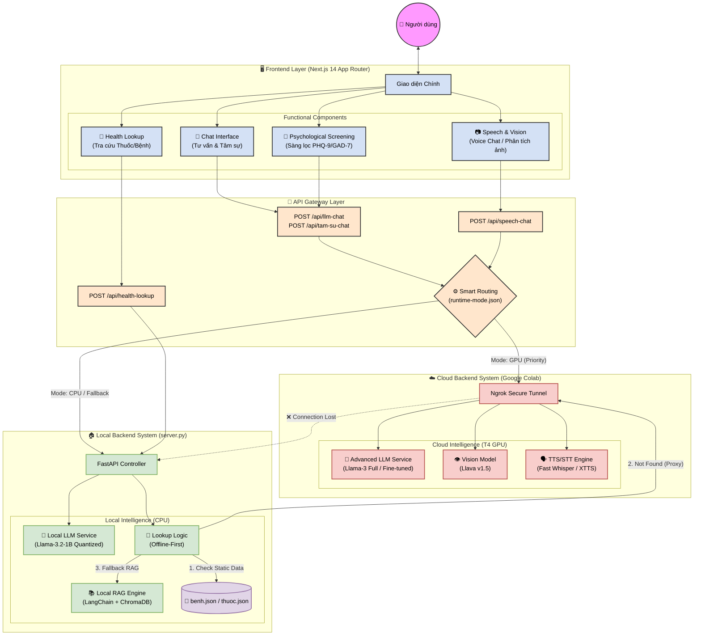

# Kiến trúc Hệ thống Tư vấn Y tế AI (System Architecture)

Hệ thống được thiết kế theo mô hình **Hybrid AI**, kết hợp sức mạnh xử lý tức thời của Local CPU và khả năng tri thức sâu rộng của Cloud GPU.

## Sơ đồ Kiến trúc Tổng quan (Mermaid Chart)

## Giải thích chi tiết các thành phần (Theo Memory Bank)

### 1. Frontend Layer (Next.js)
Được xây dựng dựa trên **Next.js 14 App Router**, đảm nhiệm vai trò giao diện người dùng và điều phối logic hiển thị.
*   **Chat Interface**: Giao diện chat chính, hỗ trợ các chế độ `Flash` (nhanh), `Pro` (thông minh), và `Tâm sự` (bạn bè).
*   **Health Lookup**: Module tra cứu y khoa chuyên biệt, ưu tiên dữ liệu tĩnh để phản hồi tức thì.
*   **Psychological Screening**: Các bài test PHQ-9/GAD-7 để đánh giá sức khỏe tinh thần, kết quả có thể được dùng làm đầu vào cho Chat Interface tư vấn tiếp.
*   **Speech & Vision**: Module đa phương thức mới, cho phép chat bằng giọng nói (STT/TTS) và gửi ảnh để AI phân tích (Vision Chat).

### 2. API Gateway & Smart Routing
Lớp trung gian xử lý logic định tuyến thông minh:
*   **Smart Routing**: Dựa vào file cấu hình `runtime-mode.json` để quyết định request sẽ được xử lý ở đâu.
*   **Cơ chế Fallback**: Tự động chuyển từ GPU về CPU nếu kết nối Cloud bị gián đoạn, đảm bảo tính sẵn sàng cao (High Availability).

### 3. Local Backend (CPU - Offline Capable)
Hoạt động trên máy cá nhân người dùng, đảm bảo các tính năng cơ bản luôn hoạt động ngay cả khi không có Internet hoặc GPU Server.
*   **Local LLM**: Sử dụng `llama-cpp-python` chạy model nén (`Llama-3.2-1B-Instruct-Q6_K_L.gguf`), đủ nhẹ để chạy trên CPU thường.
*   **Lookup Engine**: Logic tra cứu ưu tiên tìm trong file JSON (`benh.json`, `thuoc.json`) trước khi hỏi AI, giúp phản hồi cực nhanh.
*   **Local RAG**: Hệ thống tìm kiếm vector (ChromaDB) giúp AI trả lời dựa trên dữ liệu y tế đã được index.

### 4. Cloud Backend (GPU - Intelligence)
Chạy trên Google Colab (hoặc server GPU rời), cung cấp sức mạnh xử lý cho các tác vụ nặng.
*   **Advanced LLM**: Chạy các model lớn hơn, đầy đủ hơn (Full precision hoặc ít nén hơn) cho câu trả lời sâu sắc.
*   **Vision Model**: Sử dụng `llava-v1.5-7b` để "nhìn" và hiểu hình ảnh thuốc/bệnh lý.
*   **TTS/STT Engine**: Xử lý giọng nói chất lượng cao với độ trễ thấp.
